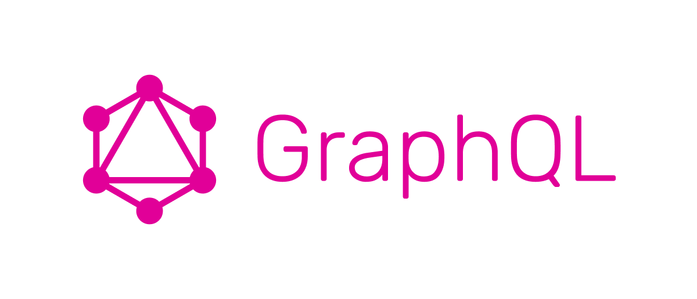

### Installation

_How installing and setting up app._

1. Clone the repo
   ```sh
   git clone https://github.com/IJ4L/go-graph
   ```
2. Configure the API
   ```sh
   DB_USER=YOUR_USER
   DB_PASSWORD=YOUR_PASSWORD
   DB_NAME=YOUR_DB_NAME
   DB_HOST=postgres
   DB_PORT=5432
   ```
3. Set up Docker Compose
   ```sh
   docker-compose up --build
   ```
4. Down Docker Compose
   ```sh
   docker-compose down --volumes --remove-orphans
   ```
